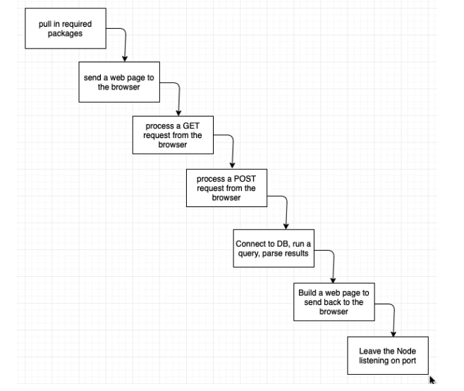

#software-development #tool 

- server-side scripting language
- handle [[HTTP call]] from client
- is initiated from command line with `node file.js`
- access filesystem with the `fs` module
- use `url.parse` to parse out host, pathname, and variable values from a URL (i.e. [[GET request]])

# Flags
`-v $(pwd):/folder` bind current directory to folder in container
`-p port1:port2` map port 1 of host to port 2 of container

# Functional diagram

# `createServer()` function
- has two arguments, res and req (from [[HTTP call]])
- writes stuff to the webpage

# Interfacing with [[PostgreSQL]]
1. build configuration string
2. build and run the query (`db.any()` method)
3. view the results (`rows[0]` as defined in `.then(function...`)

#todo a lot more from this slide deck...

[//begin]: # "Autogenerated link references for markdown compatibility"
[HTTP call]: HTTP call.md "Types"
[GET request]: GET request.md "GET request"
[PostgreSQL]: PostgreSQL.md "Unique properties"
[//end]: # "Autogenerated link references"
